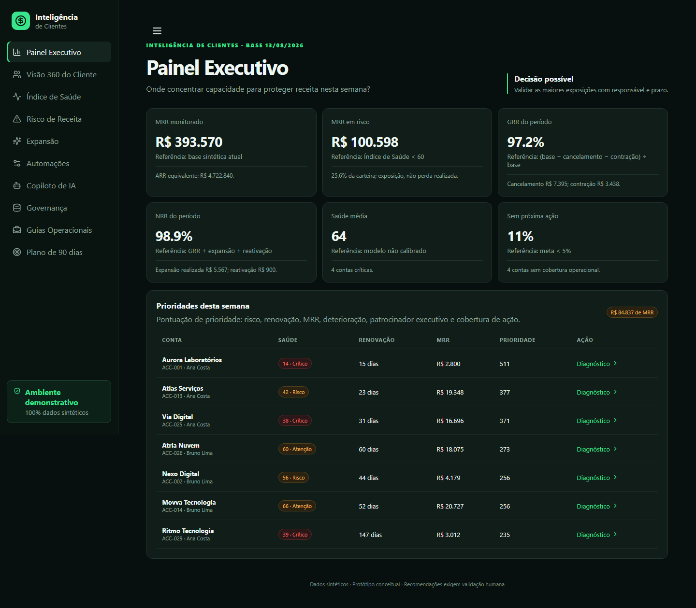
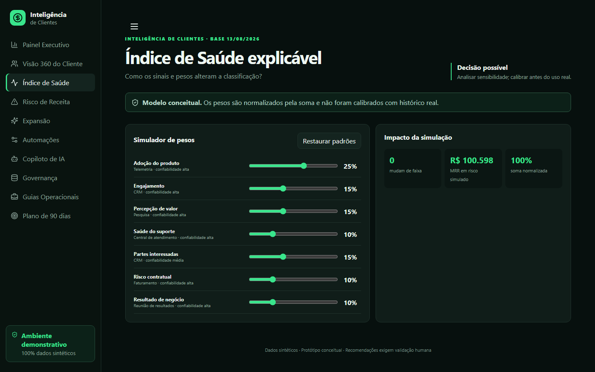

# Sistema Operacional de Inteligência de Clientes

[](https://github.com/revopsgustavo/cs-ops/actions/workflows/pages.yml)

**[Abrir demonstração](https://revopsgustavo.github.io/cs-ops/)** · [Estrutura de decisão](docs/decision-framework.md) · [Contratos das métricas](docs/metric-contracts.md)

Sistema especialista conceitual de Operações de Sucesso do Cliente e Inteligência de Receita para uma operação B2B de software como serviço. O produto transforma sinais de produto, suporte, relacionamento e contrato em uma fila de decisão auditável para retenção e expansão.



> Todos os dados são sintéticos. Este projeto é um protótipo conceitual: demonstra raciocínio, arquitetura e governança, não resultados reais. Os pesos não foram calibrados com histórico real e nenhuma recomendação substitui validação humana.

## Problema de negócio e perguntas respondidas

Times de receita costumam ter sinais fragmentados, pouca explicabilidade e ações sem responsável. O sistema responde quais clientes precisam de atenção, quais evidências sustentam o risco, quanto MRR está exposto, qual ação deve ser validada e como tornar o processo governado.

| Pergunta executiva | Resposta do produto |
|---|---|
| Qual receita está exposta? | MRR em risco reconciliado com a carteira |
| Onde concentrar capacidade? | Fila explicável com pontuação de prioridade |
| Por que agir? | Sinais positivos, negativos e contribuição dos componentes |
| Quem age e quando? | Próxima ação, responsável e SLA |
| Onde expandir com segurança? | Critério conservador separado do valor potencial |
| Quanto confiar? | Confiança do dado separada da saúde do cliente |

## Arquitetura

```text
Dados sintéticos determinísticos (src/data.ts)
    ↓ contratos e tipos
Regras analíticas puras (src/rules.ts)
    ↓ índice, risco, retenção, expansão e prioridade
Rotas e interface decisória (app/ + components/)
    ↓ comportamento verificável
Vitest + pytest + Playwright + axe + build estático
```

Next.js 15, React 19, TypeScript estrito e CSS responsivo. Aplicação exportável como site estático, sem servidor de aplicação, credenciais, API externa ou aprendizado de máquina. IA e automações são especificações simuladas por regras transparentes, sem execução externa.

## Regras analíticas

`Índice de Saúde = Σ(componente × peso) ÷ Σ(pesos)`.

| Componente | Peso inicial | Fonte simulada |
|---|---:|---|
| Adoção | 25% | Telemetria |
| Engajamento | 15% | CRM |
| Percepção de valor | 15% | Pesquisa |
| Suporte | 10% | Central de atendimento |
| Partes interessadas | 15% | CRM |
| Risco contratual | 10% | Faturamento |
| Resultado de negócio | 10% | Reunião de resultados |

Faixas: crítico 0–39, risco 40–59, atenção 60–79 e saudável 80–100. Entradas inválidas são rejeitadas e os pesos são normalizados pela soma positiva. O MRR em risco soma contas abaixo de 60. Expansão exige saúde, satisfação, pressão de uso, patrocinador executivo ativo, suporte sem criticidade e ausência de oportunidade em andamento.

GRR = `(MRR inicial − cancelamento − contração) ÷ MRR inicial`. NRR = `(MRR inicial − cancelamento − contração + expansão realizada + reativação) ÷ MRR inicial`. Potencial de expansão não é contabilizado como receita realizada.

As decisões, falsos positivos, falsos negativos e critérios de evolução estão detalhados na [estrutura de decisão](docs/decision-framework.md). As definições e os valores reconciliados estão nos [contratos das métricas](docs/metric-contracts.md).

## Dados, governança e automações

A camada sintética contém 36 contas, usa a data-base fixa 13/08/2026 e mantém `ARR = MRR × 12`. O catálogo mostra definição, fonte, responsável e criticidade; completudes exibidas são calculadas. As automações são especificações simuladas com SLA, responsável, canal e indicador, e não criam tarefas reais.

## Uso responsável da IA

O Copiloto de IA é uma demonstração local e baseada em regras. Exibe dados utilizados, confiança demonstrativa e justificativa. Em produção, saídas precisariam ser aceitas, editadas ou rejeitadas por uma pessoa; não existem decisões irreversíveis nem envio automático neste protótipo.

## Módulos

Painel Executivo, Visão 360 do Cliente, Índice de Saúde, Risco de Receita, Inteligência de Expansão, Central de Automações, Copiloto de IA, Governança de Dados, Guias Operacionais e Plano de 90 dias.

## Capturas de tela

### Visão 360 do Cliente — dispositivo móvel


### Simulador do Índice de Saúde — computador



## Qualidade comprovada

- 26 testes unitários de regras, finanças, cenários explícitos e invariantes;
- 43 testes de ponta a ponta aprovados e 3 ignorados por aplicabilidade de área de exibição, cobrindo navegação, filtros, modal, simuladores, Copiloto, 404 e menu móvel em produção;
- axe sem violações críticas ou sérias nas dez rotas e nos estados de modal, filtros e menu móvel;
- rotas estáticas independentes com atualização e navegação testadas;
- capturas de tela regeneráveis por `tests-e2e/screenshots.spec.ts`;
- fluxo público executa os portões antes de publicar no GitHub Pages.

A auditoria local de dependências corrigiu os alertas de segurança transitivos de `postcss`, `sharp` e `tmp`. Permanece um alerta alto em `extract-zip@2.0.1`, alcançável apenas pela ferramenta de desenvolvimento Lighthouse; a versão corrigida `2.0.2` ainda não está publicada no registro. O pacote não integra o artefato final da aplicação nem processa entrada de usuário neste projeto.

O Lighthouse está configurado em `lighthouserc.json`. Em 13/08/2026, a navegação e as auditorias da página inicial em modo de produção foram concluídas, mas o processo falhou ao remover o perfil temporário do Chrome (`EPERM`) antes de persistir o relatório. Não são publicadas pontuações incompletas; o ambiente e as instruções de reprodução estão em [`docs/lighthouse-results.md`](docs/lighthouse-results.md).

## Como executar

Requer Node.js 20+ e Python 3.11+.

```bash
pnpm install --frozen-lockfile
python -m pip install -r requirements-dev.txt
pnpm dev
```

Acesse `http://localhost:3000`.

## Testes e compilação

```bash
pnpm typecheck
pnpm lint
pnpm test
pnpm test:e2e
pnpm test:a11y
pnpm test:e2e:prod
pnpm build
python src/generate_data.py
python src/consultant_gap_finder.py
python src/ai_consultant.py
python src/data_quality.py
python src/reports.py
python -m compileall src app
python -m pytest
```

## Limitações e próximos passos

Os dados não representam uma empresa real; cenários não são previsões; sinais não afirmam causa raiz. Em produção seriam necessários autenticação, conectores, trilha persistente, observabilidade, segurança, testes com usuários e calibração histórica. Próximos passos: validar contratos de dados, calibrar pesos, executar piloto controlado e medir precisão operacional e adoção.

## Publicação

O `output: 'export'` gera `out/` com `pnpm build`. O fluxo automatizado `.github/workflows/pages.yml` executa os portões e somente então publica o artefato estático no GitHub Pages, usando um caminho-base específico sem alterar a experiência local.

## Autor

**Gustavo Lazzarotto**<br>
Operações de Receita, Inteligência de Clientes e Análise de Dados

## Licença

Distribuído sob a [licença MIT](LICENSE).
